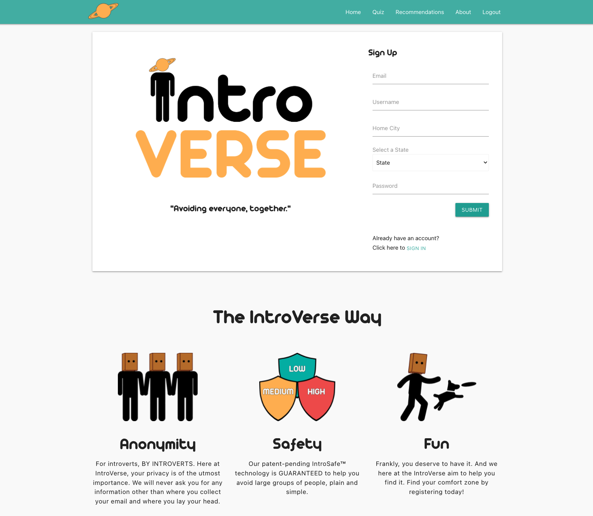
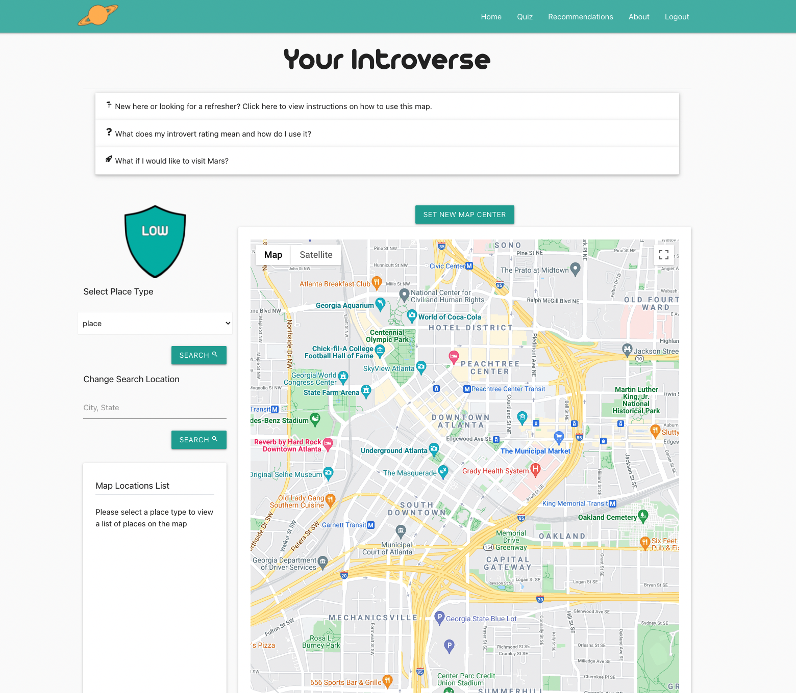
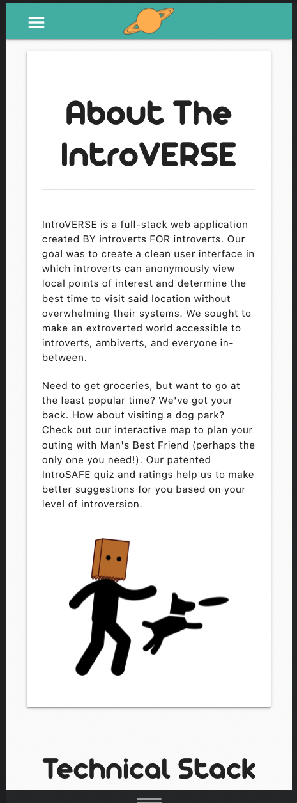
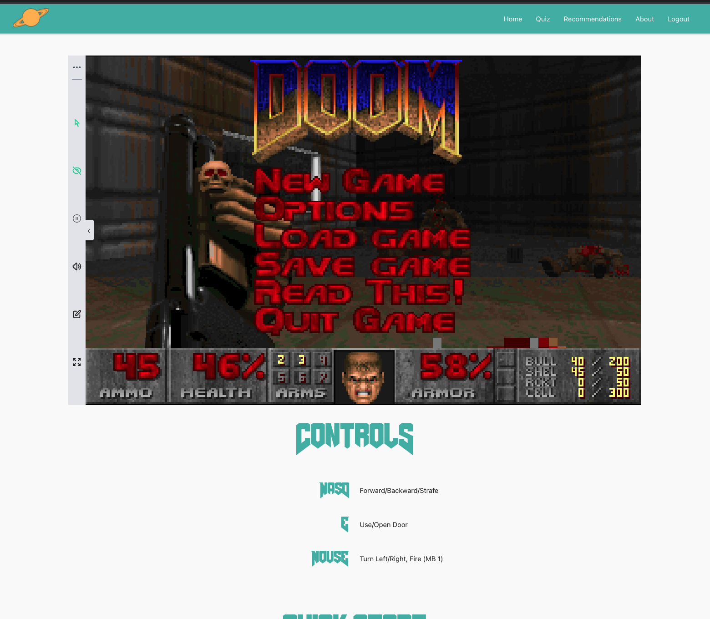

# Introverse 


***[link to deployed site]()***

IntroVERSE is a full-stack web application created BY introverts FOR introverts. Our goal was to create a clean user interface in which introverts can anonymously view local points of interest and determine the best time to visit said location without overwhelming their systems. We sought to make an extroverted world accessible to introverts, ambiverts, and everyone in-between.


Need to get groceries, but want to go at the least popular time? We've got your back. How about visiting a dog park? Check out our interactive map to plan your outing with Man's Best Friend (perhaps the only one you need!). Our patented IntroSAFE quiz and ratings help us to make better suggestions for you based on your level of introversion.

If the outside world is too busy for your liking, stay in a play the OG DOOM on our DOS emulator!

 # Video Walkthrough Placholder


---
## Tech Stack
- Languages:
    - Typescript
    - Python
    - Node.js
    - HTML
    - CSS
    - SQL
- Technologies/Libraries
    - Google Cloud APIs
    - Materialize CSS
    - AJAX
    - Passport
    - Bcryptjs
    - Sequelize
    - PostgreSQL
    - Express.js
    - Chart.js
    - JS-DOS
    - Beekeeper
    - Git
    - Github
    - Heroku

---

## MVP
-Concept: An application to support introverts in their quest for both participation in everyday tasks/activities to support wellbeing as well as the need to not be overwhelmed or disturbed by the environment around them. The introvert's guide to the galaxy - gyms, parks, grocery shopping, smoothie bars, movie theaters, Mars... Also, it runs Doom.

Project Requirements:
- Must have frontend framework (React)
- Must have backend( Node.js using Express.js)
- Must store data( PostgresSQL using Sequelize, Beekeeper, and ElephantSQL)
- Divison of Labor


---
## Stretch Goals
- Mars option
- IT RUNS DOOM!
- Expand Search Functionality

---
## Code Snippets


```
export const userSlice = createSlice({
    name: 'User',
    initialState,
    reducers: { 
        clearState: (state) => {
            state.isError = false;
            state.isSuccess = false;
            return state;
    },
        finalScore: (state, action: PayloadAction<number>) => {
            state.introvertRating = action.payload
        },
    },
    extraReducers: {
        [userSignUp.fulfilled]: (state, { payload }) => {
            state.isSuccess = true;
            state.email = payload.email;
            state.username = payload.username;
            state.homeCity = payload.homeCity
            state.homeState = payload.homeState
            state.introvertRating = payload.introvertRating
        },
        [userSignUp.rejected]: (state, { payload }) => {
            state.isError = true;
            state.errorMessage = payload.message;
        },
        [loginUser.fulfilled]: (state, { payload }) => {
            state.email = payload.email;
            state.username = payload.username;
            state.homeCity = payload.homeCity
            state.homeState = payload.homeState
            state.introvertRating = payload.introvertRating
            state.isSuccess = true;
            return state;
        },
        [loginUser.rejected]: (state, { payload }) => {
            state.isError = true;
            state.errorMessage = payload.message;
        },
        [updateIntrovertRating.fulfilled]: (state, { payload }) => {
            state.email = payload.email;
            state.username = payload.username;
            state.homeCity = payload.homeCity
            state.homeState = payload.homeState
            state.introvertRating = payload.introvertRating
            state.isSuccess = true;
            return state;
        },
        [updateIntrovertRating.rejected]: (state, { payload }) => {
            state.isError = true;
            state.errorMessage = payload.message;
        },
        [fetchUserBytoken.fulfilled]: (state, { payload }) => {
            state.isSuccess = true;
            state.email = payload.email;
            state.username = payload.name;
        },
        [fetchUserBytoken.rejected]: (state) => {
            console.log('fetchUserBytoken rejected');
            state.isError = true;
        },
    },
});

```

---
## Screenshots









---
## Developers

Victoria Walker: 

- https://github.com/v-walker
- Project Manager
- Front End Styling
- Google Maps Functionality

Hunter Hutchisson:

- https://github.com/hunterhutchisson
- Database setup and implementation
- Server Side Everything
- Server Side JSON Web Tokens

Ryan Donald:

- https://github.com/ryanthomasdonald
- Front End Styling and Logo Design
- Chart.js Implementation 
- IntroSafe Quiz functionality
- Agent of DOOM (JS-DOS setup and implementation) 

Andrew Hatch:

- https://github.com/AMHatch
- Technical Writer
- Popular Times API crawler.py setup and hosting
- JWT Authentication 
- Project Hosting and Deployment


---
## Test user/login information for demonstration

***[link to deployed site]()***

- email: test@testing.com
- password: testing
